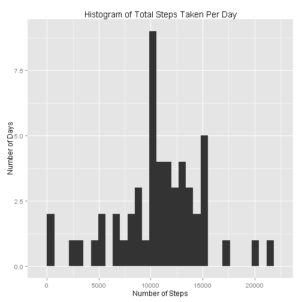
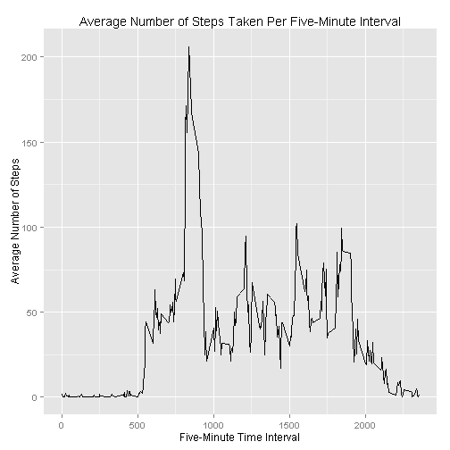
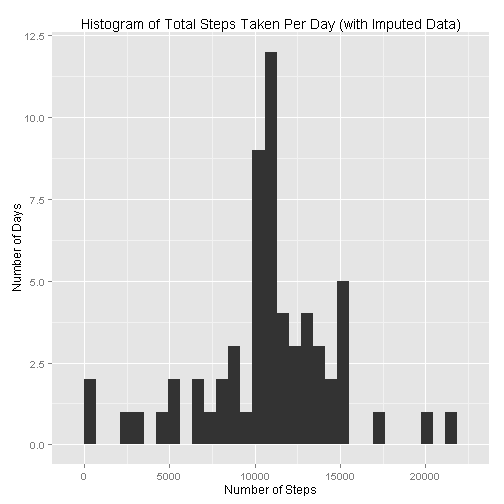
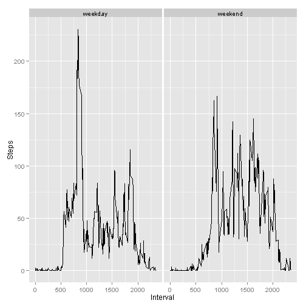

========================================================================================

### Loading and Preprocessing the Data

**1. Load the data from the zipped directory.**  


```r
# Your working directory should be set to the location on your computer to which you pulled the remote repository. Because the data in this repository is in a zipped folder, the "unz()" function is used to unzip the dataset. If you have already unzipped the data yourself, then you should remove this function from the line below and read in the dataset in the usual way.
data <- read.csv(unz("activity.zip", "activity.csv"))
```

**2. Process/transform the data (if necessary) into a format suitable for you analysis.**


```r
# Remove missing values from the dataset
dataNoneMissing <- data[!is.na(data$steps),]
```
======================================================================================

### What is mean total number of steps taken per day?

**1. Make a histogram of the total number of steps taken each day.**  


```r
library(plyr)
library(ggplot2)

stepsPerDay <- ddply(dataNoneMissing, c("date"), function(df) sum(df$steps))
names(stepsPerDay) <- c("Date", "Steps")

stepsHist <- ggplot(stepsPerDay, aes(x=Steps)) + geom_histogram() + labs(x = "Number of Steps") + labs(y = "Number of Days") + labs(title = "Histogram of Total Steps Taken Per Day")
stepsHist
```

```
## stat_bin: binwidth defaulted to range/30. Use 'binwidth = x' to adjust this.
```

 
<br>

**2. Calculate and report the mean and median total number of steps taken per day.**


```r
mean(stepsPerDay$Steps)
```

```
## [1] 10766.19
```

```r
median(stepsPerDay$Steps)
```

```
## [1] 10765
```

======================================================================================

### What is the average daily activity pattern?

**1. Make a time series plot (i.e. type = "l") of the 5-minute interval (x-axis) and the average number of steps taken, averaged across all days (y-axis)**


```r
avgStepsPerInt <- ddply(dataNoneMissing, c("interval"), function(df) mean(df$steps))
names(avgStepsPerInt) <- c("Interval", "AverageSteps")

stepsLine <- ggplot(avgStepsPerInt, aes(x=Interval, y=AverageSteps)) + geom_line() + labs(x="Five-Minute Time Interval") + labs(y="Average Number of Steps") + labs(title="Average Number of Steps Taken Per Five-Minute Interval")
stepsLine
```

 
<br>

**2. Which 5-minute interval, on average across all the days in the dataset, contains the maximum number of steps?**


```r
avgStepsPerInt$Interval[which.max(avgStepsPerInt$AverageSteps)]
```

```
## [1] 835
```

=====================================================================================

### Imputing Missing Values

**1. Calculate and report the total number of missing values in the dataset (i.e. the total number of rows with NAs)**


```r
sum(is.na(data$steps))
```

```
## [1] 2304
```
<br>

**2. Devise a strategy for filling in all of the missing values in the dataset. The strategy does not need to be sophisticated. For example, you could use the mean/median for that day, or the mean for that 5-minute interval, etc.**

For this project, we will replace all missing values with the mean number of steps for the corresponding five-minute interval. Note that we have already calculated these values in code chuck #4, and the data is stored in the variable *avgStepsPerInt*.
<br>

**3. Create a new dataset that is equal to the original dataset but with the missing data filled in.**


```r
dataImputed <- data
names(dataImputed) <- c("Steps", "Date", "Interval")
missingValues <- is.na(dataImputed$Steps)
dataImputed[missingValues,]$Steps <- join(dataImputed[missingValues,], avgStepsPerInt, by = "Interval")$AverageSteps
```
<br>

**4. Make a histogram of the total number of steps taken each day and calculate and report the mean and median total number of steps taken per day. Do those values differ from the estimates from the first part of the assignment? What is the impact of imputing missing data on the estimates of the total daily number of steps?**


```r
stepsPerDayImpute <- ddply(dataImputed, c("Date"), function(df) sum(df$Steps))
names(stepsPerDayImpute) <- c("Date", "TotalSteps")

histImpute <- ggplot(stepsPerDayImpute, aes(x=TotalSteps)) + geom_histogram() + labs(x="Number of Steps") + labs(y="Number of Days") + labs(title = "Histogram of Total Steps Taken Per Day (with Imputed Data)")
histImpute
```

```
## stat_bin: binwidth defaulted to range/30. Use 'binwidth = x' to adjust this.
```

 


```r
mean(stepsPerDayImpute$TotalSteps)
```

```
## [1] 10766.19
```

```r
median(stepsPerDayImpute$TotalSteps)
```

```
## [1] 10766.19
```
The average number of steps taken per day does not change at all when the missing values are imputed with the mean number of steps for each five-minute interval across all days in the data set, while the median number of steps taken per day does increase slightly. Overall, the total daily number of steps increases by 86,129.5, which is equal to the average number of daily steps taken, 10,766.19, multipled by the number of full days with missing data, 8.

=====================================================================================

### Are There Differences in Activity Patterns Between Weekdays and Weekends?

**1. Create a new factor variable in the dataset with two levels -- "weekday" and "weekend" indicating whether a given date is a weekday or weekend day.**


```r
library(lubridate)
dataImputed$Date <- ymd(dataImputed$Date)
dataImputed$DayType <- weekdays(dataImputed$Date)
dataImputed$DayType <- dataImputed$DayType == "Saturday" | dataImputed$DayType == "Sunday"
dataImputed$DayType <- factor(dataImputed$DayType, labels = c("weekday", "weekend"))
```
<br>

**2. Make a panel plot containing a time series plot (i.e. type = "l") of the 5-minute interval (x-axis) and the average number of steps taken, averaged across all weekday days or weekend days (y-axis).**


```r
stepsPerIntImputed <- ddply(dataImputed, c("Interval", "DayType"), function(df) mean(df$Steps))
names(stepsPerIntImputed) <- c("Interval", "DayType", "Steps")

panelPlot <- ggplot(stepsPerIntImputed, aes(x=Interval, y=Steps)) + geom_line() + facet_grid(. ~ DayType)
panelPlot
```

 
